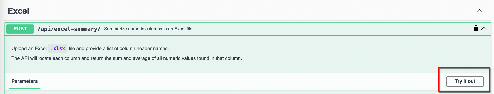
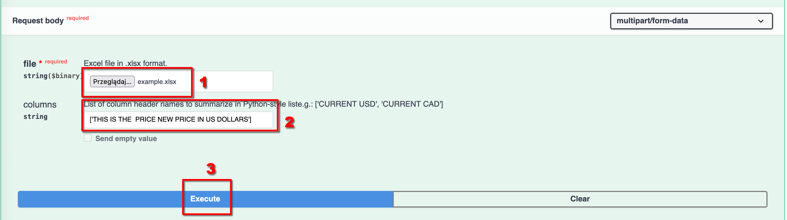

# DJANGO interview task

## Dependencies

### Python
- For Linux / Mac it should be preinstalled.
- For Windows you can download it here: https://www.python.org/downloads/windows/

### PDM
Mac / Linux:
```
curl -sSL https://pdm-project.org/install-pdm.py | python3 -
```
Windows:
```
powershell -ExecutionPolicy ByPass -c "irm https://pdm-project.org/install-pdm.py | py -"
```

## Setup the environment
```
pdm install
```

## Run the app
```
pdm run python manage.py migrate
pdm run python manage.py runserver
```

### Call the API
1. Go to: http://127.0.0.1:8000/api/docs/
2. Press 'Try it Out' under the 'Excel Upload' endpoint.

3. Upload the file (1), provide column names (2) and click Execute (3).



